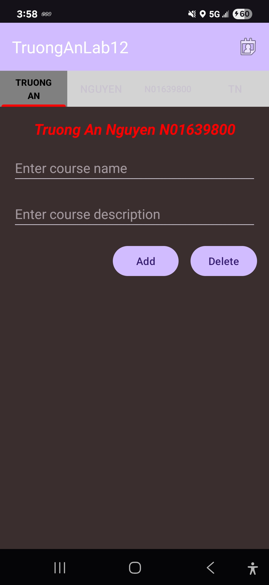
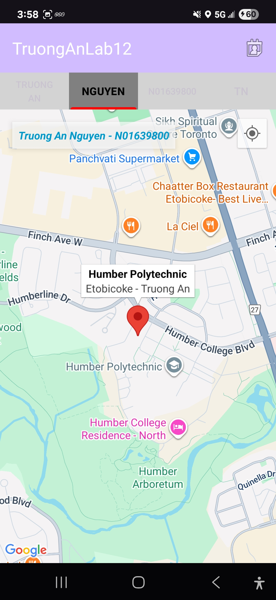
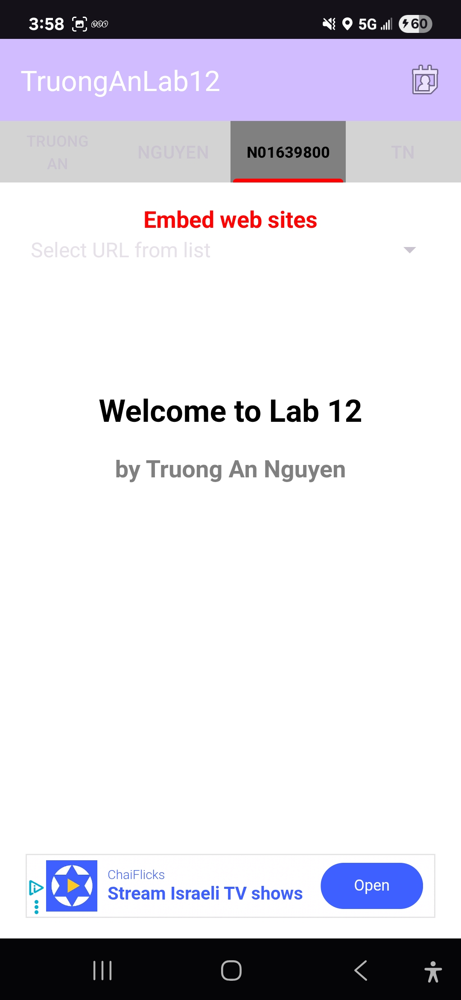

# Lab 12 Android App – TabLayout, Firebase, Maps, WebView, SMS

**Name:** Truong An Nguyen  
**Student Number:** N01639800  
**Email:** n01639800@humber.ca  
**GitHub Repo:** [TruongAnNguyenLab12](https://github.com/TruongAnNguyen9800/TruongAnNguyenLab12)

---

## 📱 Purpose

This Android app demonstrates the use of `TabLayout` with four custom fragments. Features include Firebase Realtime Database, Google Maps, WebView, SMS sending, runtime permissions, and notifications.

---

## 🔁 Main Features

### 🔳 TabLayout with ViewPager2

- Uses `TabLayout` and `ViewPager2` with 4 tabs:
  1. **Jo11hn** – Course Entry with Firebase
  2. **Sm22ith** – Google Maps and Notifications
  3. **N01639800** – WebView and Banner Ads
  4. **TN44** – SMS Sender

- Custom tabs:
  - Each tab has its own **icon and label**
  - **Selected tab** has:
    - Red icon
    - Red text
    - Unique background

---

## 🧭 Toolbar Behavior

- Toolbar has a menu icon that is **always visible**
- Menu behavior:
  - If on tab 1–3 → navigates to tab 4
  - If already on tab 4 → shows an `AlertDialog` with green background displaying the **first contact's name and phone number**

> ℹ️ App requires **minimum 4 contacts** on device/emulator for the dialog to work.

---

## 🧩 Fragment Details

### 1️⃣ Truo11ngAn Fragment – Firebase Course Entry

- Displays:
  - Centered TextView with **Full Name + Student ID** (bold, italic, red)
  - `EditText` for Course Name (auto uppercase)
  - `EditText` for Course Description (numbers not allowed)
- Buttons:
  - `Add`: Validates and adds course to Firebase + RecyclerView
  - `Delete`: Clears all courses from Firebase (shows toast if empty)
- Features:
  - Long press to delete individual course from Firebase
  - Realtime sync with Firebase database

> 🔧 Course format must be like `XXXX-123` or `XXXX-1234`

---

### 2️⃣ Ngu22yen Fragment – Google Maps & Notification

- Shows:
  - Top TextView (Full Name + ID, blue, bold, italic)
  - Google Map centered on Humber (custom location)
  - Marker with:
    - Title: Location name
    - Snippet: “City - First Name”
- Map Interactions:
  - Click map to:
    - Get address via `Geocoder`
    - Add marker and zoom
    - Update TextView + show Snackbar
    - Send **notification** with:
      - Title: Full name
      - Content: Address
      - Sound, vibration, small icon

> 📍 All permissions handled dynamically (API 33+ compatible)

---

### 3️⃣ N0163339800 Fragment – WebView + Banner Ads

- Components:
  - Top TextView (Welcome + ID)
  - Spinner with 3 websites (CBC, CTV, Humber)
  - `WebView` for site loading
  - `AdView` Banner (Google AdMob)

- Behavior:
  - Default loads HTML file from `/assets`
  - Spinner selection loads external site in WebView
  - On Ad click, shows toast with: `Truong An Nguyen + click count`

> 🌐 Uses `WebViewClient` to avoid opening browser

---

### 4️⃣ TN44 Fragment – SMS Sending

- Layout:
  - `TextView` rotated +45°: First name (red)
  - `TextView` rotated -45°: Last name (blue)
  - `EditText`: Phone number (max 10 digits)
  - `EditText`: Message
  - `Button`: "Send SMS" (dark blue, white bold)

- Features:
  - Validates:
    - Non-empty fields
    - Phone = exactly 10 digits
  - Sends SMS directly using `SmsManager`
  - Uses `PendingIntent` to:
    - Show toast for **sent**
    - Show toast for **delivered**
  - Requests **runtime permissions** for SMS

---

## 🛠 Technical Features

- **SharedPreferences**: Used for state saving (e.g., Spinner selection)
- **Firebase Realtime DB**: Used for course list in Fragment 1
- **Google Maps + Geocoder**: Reverse geocoding and dynamic markers
- **WebView**: Local + external website loading
- **AdMob**: Banner ads with interaction counter
- **SMS + Notification**: Programmatic SMS and push alerts

---

## 📁 Assets and Setup

- `res/drawable/`: Icons for tabs
- `res/values/strings.xml`: Course hints, websites, location names
- `AndroidManifest.xml`: All permissions + Google Maps key
- Firebase and AdMob setup complete
- SMS requires testing on real device (not all emulators support it)

---

## 🧪 Testing Checklist

- [x] Minimum 4 contacts on emulator/device
- [x] Google Maps API key enabled
- [x] Firebase DB permissions open
- [x] AdMob banners show + click counter
- [x] SMS permissions tested (real device recommended)

---

## ✅ Completed Features

| Feature | Status |
|--------|--------|
| TabLayout + ViewPager2 | ✅ |
| Firebase Course Entry | ✅ |
| Google Maps + Notifications | ✅ |
| WebView + Spinner + Ads | ✅ |
| SMS sending + runtime permissions | ✅ |
| Toolbar menu + dialog | ✅ |

---

## 🔗 GitHub Repository

👉 [https://github.com/TruongAnNguyen9800/TruongAnNguyenLab1011](https://github.com/TruongAnNguyen9800/TruongAnNguyenLab1011)

---

